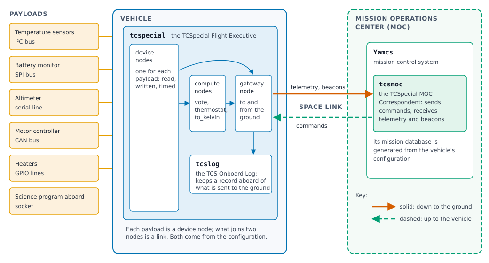
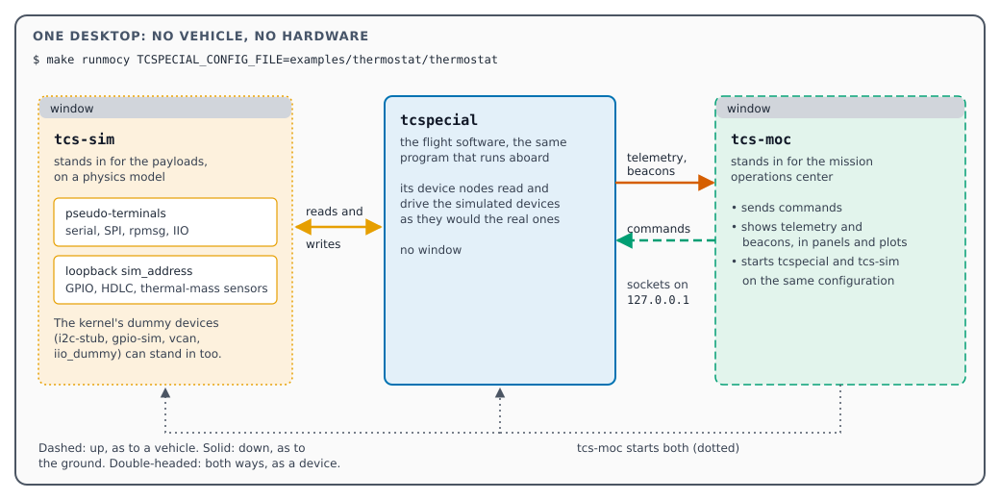

============================
TCS Design and Documentation
============================

.. warning::
   TCSpecial is an alpha release. It is not fully tested, it is not feature
   complete, and it is subject to rapid change. Until 1.0, any change to its
   API changes the minor version number (0.1 to 0.2), so a release that
   changes only the patch number never breaks code built against it.
   Feedback is welcome, even at this stage: open an issue at
   https://github.com/vomlehn/tcspecial/issues.

TCSpecial is **telemetry and control, special**, and it is flight software.
It connects the devices aboard a vehicle -- on an I\ :superscript:`2`\ C
bus, a SPI link, a serial line, a CAN bus, a set of discrete lines, a
socket or a device file -- to the places their data has to reach: the
mission operations center, the **MOC**, on the ground, and software aboard
that computes from it, keeps it, or sends it on. Every one of those is a
**node**, and what joins two is a **link**, and both are read from a
configuration file at startup, so what a particular vehicle does is a file.

The TCS software
================

TCSpecial is the hub of the TCS software. Everything else is built around
it: the programs that write, check and test its configurations, the
library a ground station uses to talk to it, and the projects it is built
from. This page introduces all of them and links to their manuals.

Some of those projects are products in their own right, used with or
without TCSpecial: tcs-xtce, its XTCE editor tcs-xtcee and its XTCE
libraries, in every language they support, and tcslog and tcslog-tools.
None of them needs TCSpecial; TCSpecial uses them.

In flight
---------

         I2C bus, a battery monitor on SPI, an altimeter on a serial line, a
         motor controller on CAN, heaters on GPIO lines and a science
         program on a socket -- are each read and driven by a device node.
         Compute nodes work on what they read, a gateway node sends it to
         the ground, and tcslog keeps a record aboard of what was sent.
         Telemetry and beacons go down the space link to the mission
         operations center, where Yamcs uses tcsmoc for its end of the link,
         and commands come back up.
   :width: 100%

   A vehicle running tcspecial, and the ground station that commands it.

Aboard the vehicle, the TCSpecial Flight Executive, **tcspecial**, runs the
payloads. Each payload is
reached through an interface of its own -- I\ :superscript:`2`\ C, SPI, a
serial line, CAN, GPIO lines, a socket to a program aboard, and others --
and is a device node in the configuration's graph. Compute nodes vote
between redundant sensors, convert units and run thermostats; a gateway
node is the vehicle's end of the link to the ground. tcspecial keeps a
record aboard of what it sent down, in a log written by the TCS Onboard
Log, **tcslog**, a library of its own.

On the ground, a mission control system such as Yamcs (https://yamcs.org)
holds the other end of the link through the TCSpecial MOC Correspondent,
**tcsmoc**. Both ends share TCS Link Support, **tcsprotocol**, which
says what goes on the link.
tcsmoc sends the vehicle its commands, receives its telemetry and beacons,
and knows from the vehicle's configuration where each datum arrives and
what it is; Yamcs's mission database is generated from the same
configuration, so the two ends cannot disagree about the link. The link's
packets are packed and unpacked by code that **tcs-xtce** generates from
their XTCE description. Back on the ground, **tcslog-tools** reads a log
that has come down from the vehicle.

On a desktop
------------

         the left, tcspecial in the middle and tcs-moc at the right. make
         runmocy starts tcs-moc, which starts tcspecial and tcs-sim on the
         same configuration. tcs-moc sends tcspecial commands and shows the
         telemetry and beacons it sends back, over sockets on 127.0.0.1.
         tcspecial reads and writes the devices tcs-sim simulates, behind
         pseudo-terminals and loopback sim_addresses, as it would real ones.
   :width: 100%

   The same software, every connection made on one desktop.

None of it needs a vehicle. On one desktop, **tcs-sim** stands in for the
payloads, on a physics model of the world they act on, and **tcs-moc** for
the mission operations center, and between them runs the same tcspecial that
flies. ``make runmocy`` starts all three on one
configuration, and every connection in the figure above is made on the
desktop: commands, telemetry and beacons over sockets on the loopback
interface, and the devices as pseudo-terminals and loopback addresses that
tcs-sim answers on a physics model of the payloads. A configuration can be
developed, run and watched this way long before there is hardware to run it
on, and parts of it moved to real devices one at a time.

A configuration is written with **tcs-gui**, which draws it as a diagram of
nodes and links, and checked with **tcs-verify**, which says what is wrong
with it without running any of it. Both read it through **tcsprotocol**, the
library the vehicle and the ground share, so the error a person sees on the
desktop is the one the vehicle would refuse the file with.

The link's XTCE can be read and edited with **tcs-xtcee**, the XTCE editor
that comes with tcs-xtce, and every TCS project builds its packages with
the make rules and scripts of **tcs-helpers**.

Production and non-production software
=======================================

The TCS software is in two kinds, and its documents are divided the same
way. **Production** software runs aboard the vehicle or in the mission
operations center, and is written and reviewed as such; its names have a
letter straight after ``tcs`` or ``tcslog``: tcspecial, tcsmoc, tcslog. The
rest -- the tools that write, check, simulate, test and build -- is
**non-production**, and its names have a hyphen or an underscore there:
tcs-gui, tcs-sim, tcslog-tools. Production software is built only from
production software. See `Production code and its names
<tcspecial-design.html#production-code-and-its-names>`__ in the tcspecial
design.

Read from a checkout, the links to the other TCS projects lead to their
documents in a checkout of each beside this one, as the build expects
(``../tcs-xtce`` and so on); read on the web, to their published pages.
Where neither has them, their repositories do: `tcs-xtce
<https://github.com/vomlehn/tcs-xtce>`__, `tcslog
<https://github.com/vomlehn/tcslog>`__, `tcslog-tools
<https://github.com/vomlehn/tcslog-tools>`__ and `tcs-helpers
<https://github.com/vomlehn/tcs-helpers>`__.

The manuals
===========

Production software
-------------------

`The tcspecial manual <tcspecial.html>`__
    The TCSpecial Flight Executive, and what is common to all the programs:
    the configuration files and what each payload, computation and gateway
    in them says, the shipped examples, installing, running the programs
    together, the commands the vehicle answers to, the crates used and the
    license.

The TCSpecial libraries
    `tcsmoc <../tcsmoc/README.html>`__, the TCSpecial MOC Correspondent, in
    the MOC, in Rust, and `tcsmoc-c <../tcsmoc-c/README.html>`__, its C
    interface; `tcsprotocol <../tcsprotocol/README.html>`__, TCS Link
    Support, used aboard and in the MOC.

`The tcslog manual <../../tcslog/docs/manual.html>`__
    The TCS Onboard Log: the library that keeps telemetry aboard until there
    is a link to send it down.

`The tcs-xtce manual <../../tcs-xtce/docs/tcs-xtce.html>`__, for tcsxtce
    tcsxtce, tcs-xtce's runtime: what the packet code tcs-xtce generates
    runs on, and the digest two programs check each other's XTCE with. The
    manual is tcs-xtce's, and covers the compiler as well.

`The tcs-ccsds manual`_
    The CCSDS time codes, run aboard and on the ground; a chapter of the
    tcs-xtce manual.

.. _The tcs-ccsds manual:
   ../../tcs-xtce/docs/tcs-xtce.html#ccsds-time-codes-tcs-ccsds

Non-production software
-----------------------

`The tcs-gui manual <tcs-gui.html>`__
    The editor. tcs-gui draws a configuration and its simulator
    configuration as diagrams of nodes and links, checks them as they are
    edited, and writes them back.

`The tcs-sim manual <tcs-sim.html>`__
    The payload simulator. tcs-sim answers for a vehicle's payloads as their
    devices would; its manual also describes the simulator configuration
    that says how.

`The tcs-moc manual <tcs-moc.html>`__
    The simulated operations center. tcs-moc shows what the vehicle sends
    the ground, panel by panel and in plots, and sends it commands.

`The tcs-verify manual <tcs-verify.html>`__
    The checker. tcs-verify reads a configuration and says what is wrong
    with it, running none of it.

`The tcs-xtce manual <../../tcs-xtce/docs/tcs-xtce.html>`__
    The compiler from XTCE to Rust, C, C++ and Python, which generates the
    code that packs and unpacks the link's packets. `The tcs-xtce manuals
    <../../tcs-xtce/docs/manual.html>`__ list it and the others below.

`The tcs-xtcee manual <../../tcs-xtce/docs/tcs-xtcee.html>`__
    The XTCE editor.

`The tcslog-tools manual <../../tcslog-tools/docs/tcslog-tools.html>`__
    The programs that read a tcslog log on the ground.

`The tcs-helpers README <../../tcs-helpers/README.html>`__
    The make rules and scripts the TCS projects share to build their
    packages, check their names and keep their pages up to date.

The design documents
====================

`The TCSpecial design documents <design.html>`__ list TCSpecial's own, and
`the tcs-xtce design documents <../../tcs-xtce/docs/design.html>`__
tcs-xtce's.

Production software
-------------------

`The tcspecial design <tcspecial-design.html>`__
    The TCSpecial Flight Executive and what the programs share: the
    terminology, the node architecture and typed links, gateways and what
    the vehicle answers to, how a graph runs, the interface and the link,
    fault resiliency and restarts, and the requirements.

`The tcslog design <../../tcslog/docs/design.html>`__
    The TCS Onboard Log: its on-disk format, interfaces and status codes.

`The tcs-xtce design <../../tcs-xtce/docs/tcs-xtce-design.html>`__, for tcsxtce
    How tcsxtce, the runtime, packs and unpacks packets and computes the
    digest. The design is tcs-xtce's, and covers the compiler as well.

Non-production software
-----------------------

`The tcs-gui design <tcs-gui-design.html>`__
    The editor: how it draws, reads and writes a configuration, its undo
    history, autosave and recovery.

`The tcs-sim design <tcs-sim-design.html>`__
    The payload simulator: its configuration files, the physics model,
    fault injection, and the program.

`The tcs-moc design <tcs-moc-design.html>`__
    The simulated operations center: its window, what it reads, and where
    the addresses it talks to come from.

`The tcs-verify design <tcs-verify-design.html>`__
    The configuration checker.

`The tcs-xtce design <../../tcs-xtce/docs/tcs-xtce-design.html>`__
    The compiler: the XML binding, the code generators and the model they
    share.

`The tcs-xtcee design <../../tcs-xtce/docs/tcs-xtcee-design.html>`__
    The XTCE editor.

Other documents
===============

`Building a vehicle <building-a-vehicle.html>`__
    From the shipped examples to a whole vehicle, a stage at a time: the
    payloads, computations, files and gateway of a lander's science deck.
    An outline for now.

`From the desk to flight <desk-to-flight.html>`__
    What changes between a configuration that has run on a desk and one
    that flies, as a checklist.

`Writing node types <node-types.html>`__
    How to add a node type to TCSpecial.

`Third-party integration <third-party.html>`__
    The plan for making the tcs projects work with NASA's core Flight
    System (cFS) and JPL's F´ (F Prime). Work in progress.

`Examples <../examples/README.html>`__
    The shipped example configurations, and what each one shows; and `the
    tcs-xtce examples <../../tcs-xtce/examples/README.html>`__.
